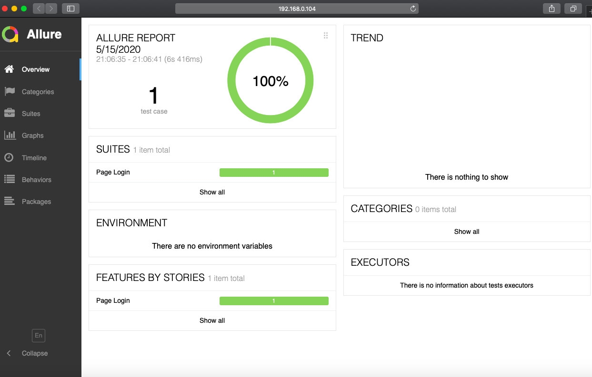

# Cy-fy

Cypress starter pack for UI and API automation testing. Simple and neat folder structure in combination with cucumber and typescript will help you write test faster.

## Table of Contents:

- [Get started](#get-started)
  - [System Requirement](#system-requirement)
  - [Project setup](#project-setup)
  - [Test configuration setup](#test-configuration-setup)
  - [UI configuration](#ui-configuration)
  - [API configuration](#api-configuration)
- [Run Tests](#run-tests)
  - [Run UI test scenarios](#run-ui-test-scenarios)
  - [Run tests in multiple browsers](#run-tests-in-multiple-browsers)
  - [Run API test scenarios](#run-api-test-scenarios)
- [Generate Reports](#generate-reports)
- [Lint test codes](#lint-test-codes)
- [Folder structure](#folder-structure)
- [Quick guide to write tests](#quick-guide-to-write-tests)
  - [Prepare use cases as features](#prepare-use-cases-as-features)
  - [Develop page actions](#develop-page-actions)
  - [Develop step definitions](#develop-step-definitions)
- [Generate reports](#generate-reports)

## Get started

#### System Requirement

- Git (download form [here](https://git-scm.com/downloads))
- Node (download from [here](https://nodejs.org/en/download/))
- Java Run Time (download from [here](https://www.oracle.com/in/java/technologies/javase-downloads.html))
- Chrome, Firefox and Edge (checkout [here]())

#### Project setup

- Git clone the project
- install dependencies by `npm ci`

#### Test configuration setup

#### UI configuration

UI test environment file is located at `config/e2e.config.json`

```json
{
  "baseUrl": "https://the-internet.herokuapp.com", // provide your APP url here
  "testFiles": "**/*.{feature,features}",
  "video": true,
  "defaultCommandTimeout": 4000, // you can set the timeouts according to your APP's behavior
  "execTimeout": 60000,
  "taskTimeout": 60000,
  "pageLoadTimeout": 60000,
  "requestTimeout": 5000,
  "responseTimeout": 30000,
  "screenshotsFolder": "reports/e2e/screenshots",
  "videosFolder": "reports/e2e/videos",
  "env": {
    "allureResultsPath": "reports/e2e/allure-results"
  }
}
```

#### API configuration

API test environment file is located at `config/api.config.json`

```json
{
  "baseUrl": "https://jsonplaceholder.typicode.com", // provide API base url
  "testFiles": "**/*.spec.ts", // api tests are written in mocha
  "video": false,
  "defaultCommandTimeout": 4000,
  "execTimeout": 60000,
  "taskTimeout": 60000,
  "pageLoadTimeout": 60000,
  "requestTimeout": 5000,
  "responseTimeout": 30000,
  "env": {
    "allureResultsPath": "reports/api/allure-results"
  }
}
```

## Run Tests

#### Run UI test scenarios

```js
// this will clean and run the UI cucumber scenarios in headless mode
npm run cy:e2e

// At the time of develop test code, you may want to see and debug the execution
npm run cy:ui:dev
```

#### Run tests in multiple browsers

```js
// by-default test will be triggered in Electron
npm run cy:ui:run

// to run in chrome
npm run cy:ui:run -- --browser chrome

// to run in firefox
npm run cy:ui:run -- --browser firefox

// to run in edge
npm run cy:ui:run -- --browser edge
```

#### Run API test scenarios

```js
npm run cy:api
```

## Generate Reports

As this project deals with both API and UI, reports will be generated differently rather dumping everything into the same file.

```js
// to generate UI allure reports
npm run report:ui

// to generate API allure reports
npm run report:api
```

## Lint test codes

Linting is a great way to maintain coding standards and quality across the project. Here we use ESLint to ensure the same.

```js
// to lint TS codes
npm run lint:fix

// to lint Gherkin feature files
npm run lint:gherkin

// to perform both at once
npm run lint
```

## Folder structure

```bash
├── cypress
│   ├── fixtures
│   ├── integration
│   │  ├── api
│   │      ├── **/*.spec.ts
│   │  ├── e2e
│   │      ├── pages
│   │      ├── features
│   ├── plugins
│   ├── support
```

- _**fixures**_: fixtures are used as external pieces of static data that can be used by your tests. Read more [here](https://docs.cypress.io/guides/core-concepts/writing-and-organizing-tests.html#Fixture-Files)
- _**plugins**_: plugin file contains the helper libraries to achieve a specific tasks. Different cypress plugins can be found [here](https://docs.cypress.io/plugins/index.html)
- _**support**_: By default Cypress will automatically include the support file cypress/support/index.js. This file runs before every single spec file.
- _**integration**_: integration folder contains the actual tests. The ui test scenarios are stored in `e2e` folder. `features` folder contains all feature files and step definition for cucumber. `pages` folder contains all page actions. `api` folder contains all api test cases.

## Quick guide to write tests

#### Prepare use cases as features

Using Gherkin syntaxes, you can prepare the test scenarios in `Given-When-Then` format. This is a typical way of practicing `behavior-driven-development` (BDD).

```feature
Feature: Page Login
  As a user, I want to login to the page

  Scenario: user checks login is successful
    Given user navigates to the target login page
    And user enter "tomsmith" and "SuperSecretPassword!"
    When user click the login button
    Then user should see the login success message
```

#### Develop page actions

Once you define the test scenario, you need to define the page actions required to accomplish the test scenario:

```ts
class LoginPage {
  visit(): void {
    cy.visit(`/login`);
  }

  setUserName(userName: string): void {
    cy.get('input[id="username"]').type(userName);
  }
}

export const loginPage: LoginPage = new LoginPage();
```

#### Develop step definitions

Once you are ready with the page actions, you need to tell cucumber what the page actions should be performed for specific steps. You need to glue your Gherkin steps with page actions.

```ts
Given('user navigates to the target login page', () => {
  loginPage.visit();
});
```

## Generate reports

Reports will be generated separately for API and UI test cases but will have the same essence of Allure.


